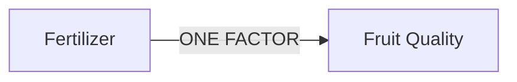
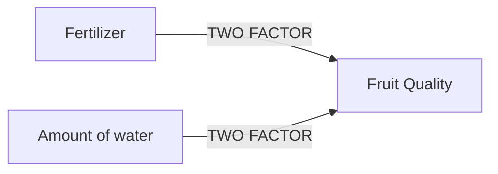
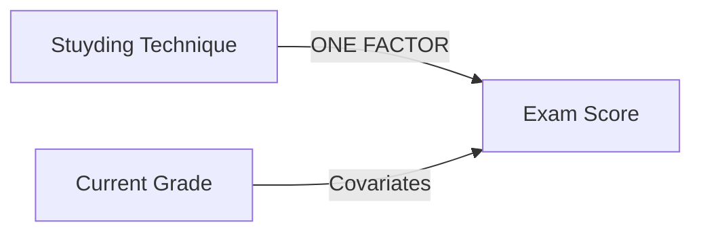
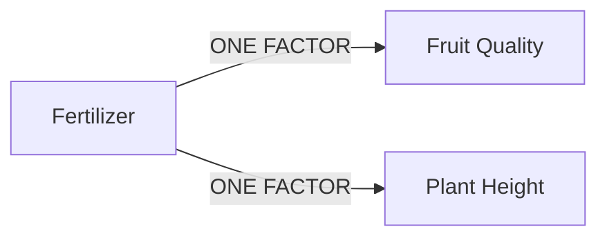
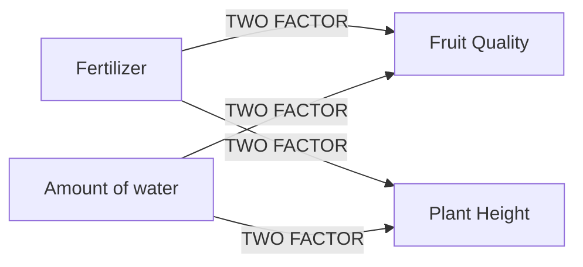
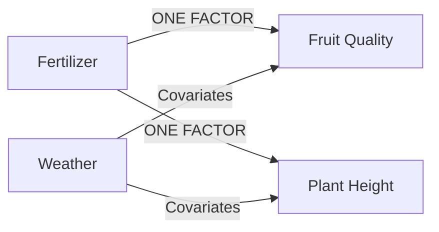
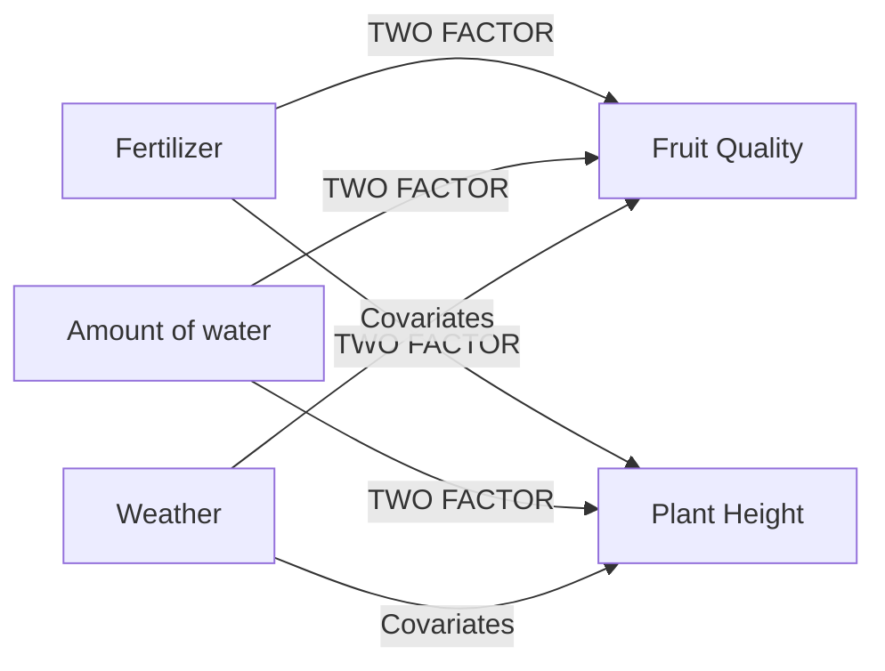

# **Statistical Methods ANOVA, ANCOVA, MANCOVA and MANCOVA**

## **ANOVA**
> ANOVA is a Statistical technique for examining the difference among means for three or more populations.We can also say Analysis of varience is ANOVA, used to determined whether or not there is a statistically significant difference between  the means of three or more independent groups. The most common types of ANOVAs are the one way and two way ANOVA. 
> - 1. One way ANOVA:
> 
>                   Used to check how is the impact considering one factor. Desi Example: agr 2 plants ko fertilizer ko factor rakh k donun k fruit quality  ko dekhain to ya hoga one way ANOVA. Q k is me hm sirf ek fator ko consider kr rhy hain.

> 
> nechy flowchart as an example given hai.

>- 2. Two way ANOVA:
>
>                   Used to check how is the impact considering two factor. Same uper Waly example me hum agr unhi plants k height growth or sath me quality of fruits b consider krain to ya hojya ga two way ANOVA q k is me hm 2 fators ko as a consideration lay rhy hain. 
> > 
> nechy flowchart as an example given hai.

> 
## **ANCOVA**
> In short analysis of covariance is also used to determine whether or not there is a statistically significant differnce between the means of three or more independent groups/samples. The Difference is an ANCOVA includes one or more covariates, which help us to better understand how a factor impacts a response variable after accounting for some covariates.
> > 
> nechy flowchart as an example given hai.

## **MANOVA**
> Inshort hm isy Multivariate analysis of variance b keh skty hain, ya ANOVA k identical hota hai magr i amw two y more responses ko dekhty hain one factor two response. Ya b one way and two way hota hai same ANOVA k trah.
> - 1. One way MANOVA:
>
>                   Used to check how is the impact considering one factor and two response of variable. Desi Example: agr 2 plants ko fertilizer ko factor rakh k donun k fruit quality or height ko dekhain to ya hoga one way ANOVA. Q k is me hm sirf ek fator ko consider kr rhy hain.
> > 
> nechy flowchart as an example given hai.

> -2. Two way MANOVA:
> 
>                   Is me two factor and two response of variables ko dekahin gay, like agr 2 plants ko fertilizer and water quantity ko factor rakh k donun k fruit quality or height ko dekhain to ya hoga one way ANOVA. Q k is me hm sirf ek fator ko consider kr rhy hain. 
> 
> nechy flowchart as an example given hai.

## **MANCOVA**
> Is also known as Multivariate Analysis of covariance. is identical to a MANOVA, except it also includes one or more covariates. Similar to a MANOVA, a MANCOVA can also be one-way or two-way.
> - 1. One way MANCOVA:
>
>                       Is me one factor with covariance and two response of variables ko dekahin gay, like agr 2 plants ko fertilizer  ko factor weather ko as a covarient rakh k donun k fruit quality or height ko dekhain to ya hoga one way MANCOVA. Q k is me hm sirf ek factor ko consider kr rhy hain. 
> > > 
> nechy flowchart as an example given hai.

> - 1. Two way MANCOVA:
>
>                       Is me two factor with covariance and two response of variables ko dekahin gay, like agr 2 plants ko fertilizer and water quantity ko factor rakh k donun k fruit quality or height ko dekhain to ya hoga one way ANOVA. Q k is me hm sirf ek fator ko consider kr rhy hain. 
> > > 
> nechy flowchart as an example given hai.
